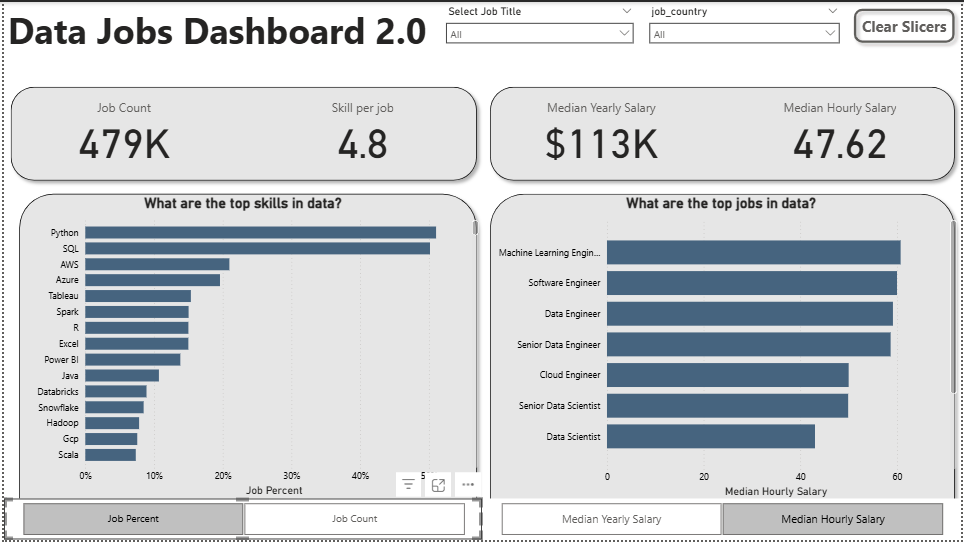

# My Power BI Dashboard Portfolio📊

Data Nerds! This repository is a collection of Power BI dashboards I've developed. It tracks my journey in usingPower BI, from foundational reports to more advanced interactive analyses, all aimed at turning data into clear, actionable insights.

# Featured Dashboards

Explore the dashboards below. Each has its own dedicated README with more details on the build process and specific features

## 📊 Data Jobs Dashboard (V1 - Comprehensive Exploration)

**Key Power BI Skills Utilized:**
* 🎨 Dashboard Layout & Design
* ⚙ Power Query (ETL & Data Shaping)
* 🔗 Basic Data Modeling (Table Relationships)
* 🧮 Implicit Measures & Standard Aggregations
* 📊 Core Charts (Bar, Line, Area, Column)
* 🗺 Map Visualizations for Geospatial Data
* 🔢 KPI Cards & Detailed Data Tables
* 🖱 Interactive Slicers for Filtering
* ⚪ Buttons & Bookmarks for PAge Navigation
* ➡ Drill_Through Functionality

[➡ **View Full Project 1 Details (README)**](/Data_Jobs_v1/README.md)

## 📊 Data Jobs 2.0 (V2 - Single-Page Focus)

**Key Power BI Skills Utilized (demonstrating progression):**
* 🎨 Advanced Dashboard Design (Single-Page UX and Optimization)
* ⚙ Complex Power Query Transformations
* 🔗 Star Schema Data Modelling Principles
* 🧮 Explicit DAX Measures (e.g., `CALCULATE`,context modifiers) 
* 📊 Dynamic Visualization (driven by Parameters/Slicers)
* ⚙ Field & Numeric Parameter Implementation for "What-IF" Analysis
* 🗺 Enhanced Geospatial Insights
* 🔢 Advanced Card Visualizations
* 🗄 Optmized Slicers & Advanced Cross-Filtering Techniques
* ✨ Report Performance Considerations.

[➡ **View Full Project 2 Details (README)**](/Data_Jobs_V2/README.md)

## About This Portfolio

Each dashboard linked above has a detailed `README.md` file in its project folder. This file provides information about the project goals, data sources, specific Power BI techniques used, and details on how the dashboard was built.